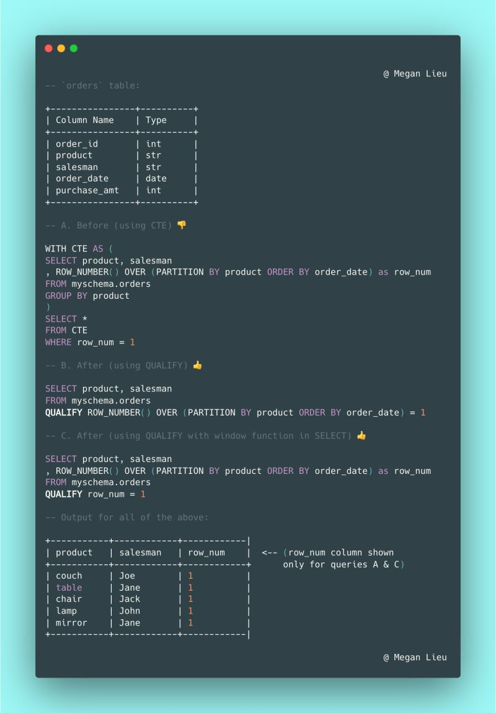

# Qualify

The coolest SQL clause you’ve probably never heard of: QUALIFY! 🤩

Or maybe you’re a SQL pro like Benjamin Brenner (who showed me how to use this) and you HAVE heard of it before, but *I* definitely didn’t when learning my SQL fundamentals or even more advanced SQL concepts.

In last week’s SQL tip, I talked about advanced filtering without using any window functions. I have no issue with using window functions (besides the query efficiency argument), but you normally can’t use them to filter your results, since they’re not allowed in WHERE or HAVING clauses….

Until now! QUALIFY allows you to filter the results of window functions, and basically does to window functions what HAVING does to aggregate functions.

To be able to QUALIFY a query, you can either use a window function in the QUALIFY clause or you can use it to reference a window function used in your SELECT list.

Result: you can avoid the complicated subqueries and CTEs that are normally required if you want to filter based on a window function!

Let’s look at the same example we worked with last week, where we want the name of the salesman who sold the first order of each product category, to see QUALIFY in action 👇

**QUALIFY is currently only available in select warehouses like BigQuery, Teradata, Snowflake and Databricks**

[posts](https://www.linkedin.com/posts/meganlieu_sql-coding-datascience-activity-6970521407801688064-QGPn?utm_source=share&utm_medium=member_desktop)

#SQL #coding #datascience

